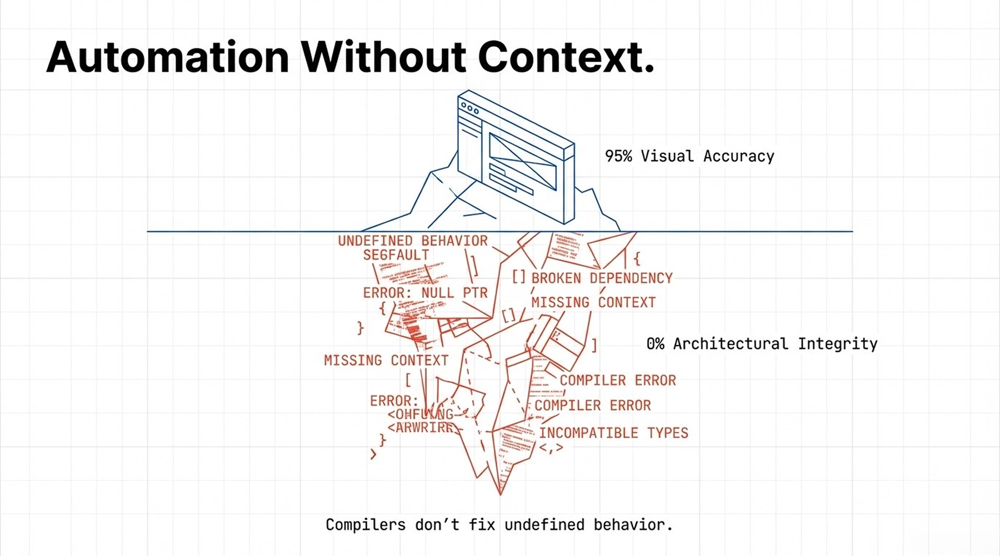
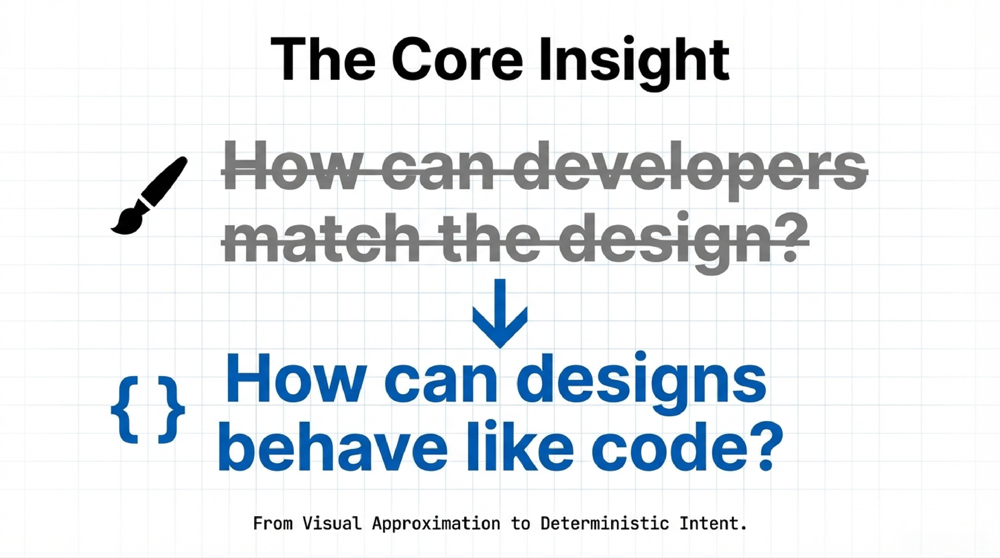
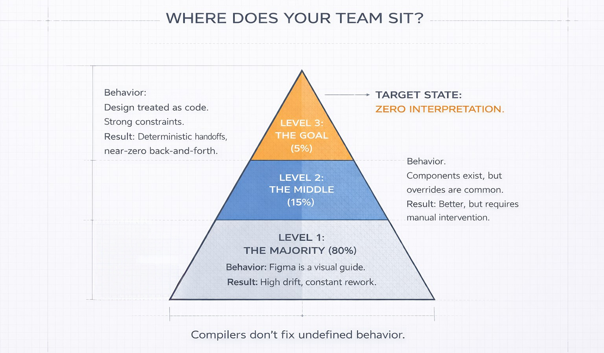
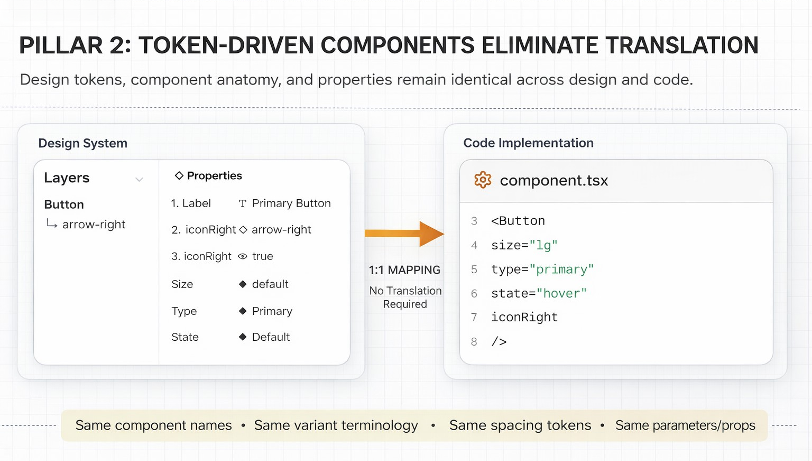
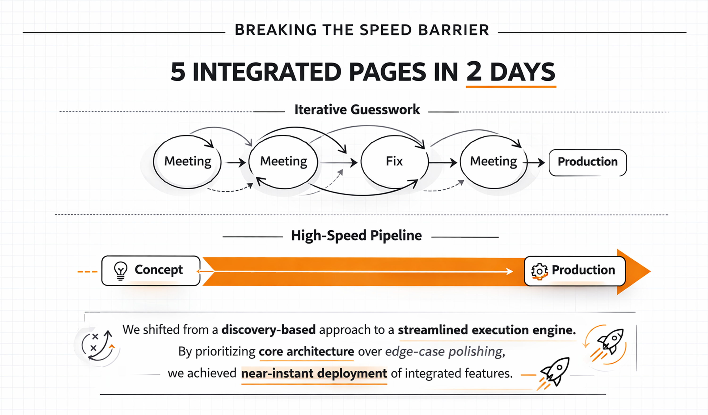
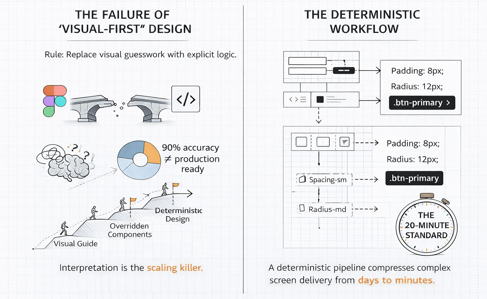
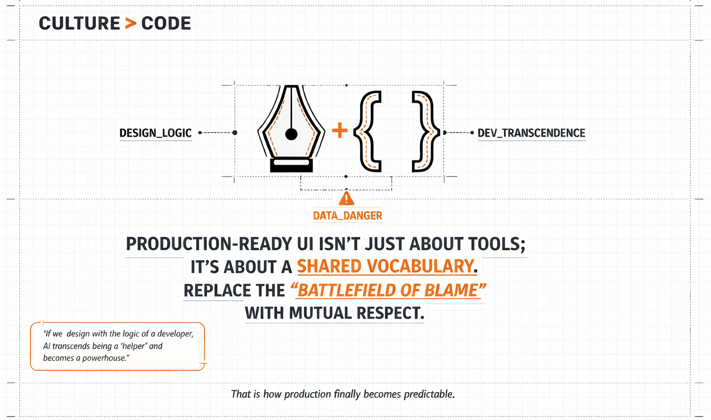

# The Myth of Seamless Figma-to-Production Workflows

## Why Figma MCP Isn’t Enough

### *Why Figma MCP Alone Can’t Guarantee Production-Ready UI — and What Product Teams Must Do Instead*

**Extraordinary results require an extraordinary team.**

I’m surrounded by people who treat design and development like a mission. They are warriors in the tech trenches, and this win belongs to them.

No fluff. No filler.

Just the facts on how we shattered our velocity records *without sacrificing production accuracy*.

## 1. From Minor Mismatches to Major Rework

Most teams believe their biggest UI problem is velocity. (how quickly they can build interfaces)

In reality, the bigger problem is **accuracy at scale**.

Even after strong designs, we repeatedly ran into issues like:

- Spacing between elements not matching Figma
- Padding inconsistencies between tags, buttons, and containers
- Edge distances breaking responsive layouts
- Components recreated differently by each developer
- Minor pixel mismatches causing repeated QA cycles

Individually, these issues look small.

In production, they **compound into weeks of rework**.

---

## 2. Why Traditional Figma → Dev Handoffs Fail

The problem was never Figma.

It wasn’t the developers.

And it definitely wasn’t effort or intent.

**The real failure was an assumption:**

> “Designs are visual. Developers will interpret them.”
> 

That assumption holds at small scale — and collapses at real ones.

It breaks when:

- Components look the same but behave differently
- Spacing is suggested, not specified
- Design and code speak different naming languages
- Changes land in design but never ripple through the system

The outcome is predictable:

Design becomes **static**.

Development becomes **interpretive**.

**And interpretation is what breaks at scale — because every developer interprets differently.**

### Our brief, beautiful tragedy

> I remember this one project where we had a bunch of devs working at once, and we all treated Figma like it was the holy grail.
> 

> At first? Smooth sailing. The screens looked clean, tickets were moving, and the vibes were good. But then the small changes started creeping in, and things got messy fast.
> 

> A tweak that took a designer thirty seconds to drag-and-drop turned into three separate meetings for us. One screen would be perfect, but the next one—supposedly using the same component—would be totally off. It was exhausting. The designers felt like they were repeating themselves, and as developers, we felt like we were stuck in a loop, fixing the same bugs over and over.
> 

> The deadlines weren’t tight because the code was hard; they were tight because we were burning time trying to guess the *intent* of the design rather than just building it. That’s when it hit me: the problem wasn't our effort. It was that the design wasn't actually speaking the same language to all of us.
> 

---

## 3. “Looks Right” ≠ Production Ready

We explored multiple tools to automate Figma → code translation.

When we started using **Figma MCP**, the initial results looked promising:

- ~80–95% visual accuracy in a single pass
- Faster initial scaffolding
- Minimal manual setup

But once we tested it in real production projects, the cracks appeared:

- Components were generated from scratch
- CSS was defined at page or section level
- Design systems weren’t consistently followed
- Existing components weren’t reused
- Output didn’t align with our internal architecture

The UI looked correct.

The output was **not production-ready**.

**MCP is not a design system. It’s a compiler.**

And compilers don’t fix undefined behavior.

Automation without **context** still fails.

---

## 4. The Core Insight: Why Design Must Follow Engineering Rules

The breakthrough came when we flipped the question.

Instead of asking:

> “How can developers match the design?”
> 

We asked:

> **“How can designs behave like code?”**
> 

That single shift changed everything.

### Our new operating laws

- **Figma is a source of truth**, not a visual reference
- **Every design decision must be deterministic**, not interpretive
- **Design output must be reproducible**, just like code
- **Anything that cannot be expressed as a component or parameter is a design defect**
- **No visual-only exceptions** — everything must map to a real implementation
- **Designs must fail loudly**, not silently

This isn’t idealism.

It’s how scalable systems survive.

### A hard industry truth

In practice:

- **70–80% of teams** treat Figma as a visual guide
    
    Developers are expected to “figure it out.”
    
- **15–20% of teams** sit in the middle
    
    They have components and tokens, but overrides and “just this once” tweaks still happen.
    
- **5–10% of teams** treat design like code
    
    Strong constraints. No visual-only exceptions. Clean 1:1 mapping.
    

For that small group:

- fewer handoffs
- fewer bugs
- dramatically less back-and-forth

Once teams reach this level, they almost never go back.

---

## 5. Turning Figma into a Deterministic System

We stopped treating Figma like a mockup tool and started treating it like **production code**.

### 1. Enforced Component Hierarchy

- **Foundation**: buttons, text, icons
- **Building blocks**: cards, forms, nav items
- **Structures**: layouts, sections, pages

Each layer is:

- reusable
- composable
- constrained by the layer below

No skipping levels.

No ad-hoc assemblies.

---

### 2. Parameters Over Pixels

We replaced visual guesswork with explicit rules:

- Spacing comes from tokens
- Padding is a parameter
- Border radius is a variable
- Typography is system-defined

Designs became **machine-readable**, not just human-readable.

As a result, AI tools (including MCP) can:

- understand intent instead of inferring it
- reuse existing components
- generate output that holds up at scale

Small shift.

Massive reduction in drift.

---

### 3. One-to-One Naming with Code

What exists in code **must exist in Figma**, with a direct, unambiguous mapping:

- identical component names
- identical props and variants
- identical spacing and token values

Semantic names are allowed **only** when:

- the mapping is unambiguous
- the name is AI-resolvable
- the underlying token remains identical

No aliases.

No decorative naming.

> If it can’t be mapped to code with certainty, it doesn’t ship.
> 

Perfect alignment is the goal, but gains appear much earlier.

Today, nearly **80% of our system is aligned** — and AI smooths out the rest.

We’ve introduced a range of low-level, intermediate, and high-level components in Figma—[click through to explore and understand how they come together.](https://www.figma.com/design/IrQnJU0nUqiMWdnVtXUZlk/Figma-to-Production?node-id=1-2&t=l6Kv36ugdybpSkIU-1)

---

## 6. The Global Update Rule

A non-negotiable constraint:

> **Change it once. Let it propagate everywhere.**
> 

To enable this, we removed entire classes of freedom:

- Everything is a component
- Instances are never detached
- Overrides are treated as defects

Changing button padding, card spacing, or type scales now propagates:

- through all designs
- into generated code
- across the live product

This isn’t a preference.

It’s how scalable frontend systems are built.

---

## 6. We broke the speed barrier without compromising production accuracy.

We just hit a major engineering milestone that feels a bit like magic : build 5, backend-integrated pages in a 2 days. By prioritizing core functionality and architectural alignment over edge-case polishing, we’ve drastically accelerated our development velocity and proven our team's ability to execute at scale. See these pages live in real production. Join the waitlist.

We broke the cycle of iterative guesswork by engineering a high-speed, automated pipeline. Our workflow has officially transitioned from a 'discovery-based' approach to a streamlined execution engine, enabling near-instant deployment of integrated features.

### The Velocity Shift

- **The Calibration Phase:** We dedicated a full day to hard-wiring our MCP tool into Figma and, more importantly, refining the "brain" of the operation. We systematically identified where the tool was tripping up, cleaned our naming conventions, and overhauled our prompting logic. By correcting those early friction points, we taught the system to translate design intent into code with surgical precision.
- **The 60-Minute Screen:** The moment it clicked, everything changed. We went from manual coding to "conversational building," producing a production-ready screen in under an hour.
- **The 20-Minute Standard:** Guesswork is gone. Because the "pre-work" is baked into the pipeline, we’ve compressed the delivery of complex screens down to a 20-minute flow.

**The Road Ahead:** While 20 minutes is fast, we aren’t satisfied. There is still room to optimize, and we are pushing for even higher velocity. Currently, the "heavy lifting" has shifted—designing in Figma is now taking longer than the actual development. We are actively working to bridge this gap and reduce the friction for our design team.

To the community: If you have tips for high-speed, production-grade design creation, share them with us! And to design team: Hang in there—we’re working on the tools to make your workflow as seamless as our new pipeline.

## **The Final Word**

**The Final Word:** > Production-ready UI isn’t just about better tools; it’s about a **shared vocabulary.** > When we bridge the gap between design and engineering with a unified structure, the friction disappears.

**The reality is simple:** > If we design with the logic of a developer, AI transcends being a "helper" and becomes a powerhouse.
That is how production finally becomes predictable.

**I write this as Bahubali Magadum:** This isn’t just about code; it’s about how we treat one another. We must replace the "battlefield of blame" with a culture of mutual respect. We are sharing our journey to help the community —I welcome your thoughts and feedback as we build this future together.

CTO Tandemloop
